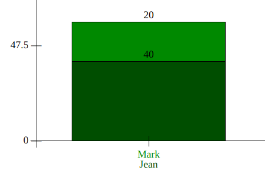

# Bar Charts API

### About

This library was built as my first JS project in preparation for the Lighthouse Labs Web Development bootcamp. The main.js file can be used to render bar charts within any HTML element. Head over to the [landing page](https://ericos-bennett.github.io/Bar-Charts-API/) to see some examples. The library requires jQuery.

The main function takes 3 parameters to generate a chart:

```javascript
drawBarChart(data, options, element);
```

The **data** parameter must be formatted as an array of arrays of objects. The sub-arrays represent vertical bars, and each object within them a distinct bar section. This data structure allows for the rendering of stacked bars. For example, the following data input:

```javascript
const data = [
  [
    {
      value: 40,
      label: 'Jean',
      barColor: '',
      labelColor: '#004e00'
    },
    {
      value: 20,
      label: 'Mark',
      barColor: '#008900',
      labelColor: ''
    }
  ]
];
```
Would display a single vertical bar with 2 stacked sections:



The **options** parameter receives an object, and allows you to specify certain options for the graph. Here is an example argument, see the feature list below for details on each property:

```javascript
const options = {
  title: 'Racing Distances',
  titleSize: '40px',
  titleColor: '#4e0000',
  unitsMessage: 'KMs covered by each race participant by group',
  valueLabelPosition: 'top',
  yAxisDivisions: 4,
  barWidthSpacing: '0.25',
  defaultBarColor: '#a67f00',
  defaultLabelColor: '#black'
}
```

The **element** parameter receives a HTML element which can be manipulated via jQuery, such as:

```javascript
const element = ('#bar-box')
```

### Feature List

##### Bar Color
- The color for each individual bar section can be specifed with its object's `barColor` property.
- If a `barColor` value is not specified, the bar will be rendered with the object's `labelColor` property.
- If neither property is specified, the bar will be rendered with the `defaultBarColor` options property.

##### Labels
- If a `label` value is specified for a bar section, that label will be rendered below the x-axis.
- If any label would overflow into the next bar's area, all labels are rotated 40^o^.
- The color for each individual label can be specifed with its object's `labelColor` property.
- If a `labelColor` value is not specified, the bar will be rendered with the object's `barColor` property.
- If neither property is specified, the bar will be rendered with the `defaultLabelColor` options property.

##### Title
- If specified with the `title` options property, the title will display left-justified at the top of the chart.
- The title's size and color can be specified with the `titleSize` and `titleColor` properties respectively.
- The `unitsMessage` options property will render as a sub-title below the title element.

##### Value Label
- Each bar section shows a label for its value (height). By default, this will display right below the top of the element. To change this, use one of the below allowed values for the `valueLabelPosition` options property:
    - `top` - renders just above each bar section
    -  `center` - renders at the center of each section
    - `bottom` - renders at the bottom of each section

##### Y-Axis Ticks
- The y-axis always shows ticks for the highest bar value and for 0 (or the lowest value if negative).
- The `yAxisDivisions` options property specifies how many divisions the y-axis should be cut into. For example, a value of 4 would cut the y-axis into quarters. If the highest value was 8 and the lowest >0, the added ticks would be at 2, 4, and 6.

##### Bar Width
- By default, each bar takes up 100% of its width, with no space between them.
- The `barWidthSpacing` options property specifies the ratio of white space between bars to each bar width. For example, a value of 0.25 would show white space between the bars that is 1/4 the width of each bar.

### Known Issues

- Y-axis labels do not work well with very small decimal numbers. The formula for calculating significant digits does not crop them appropriately so there can be overflow.
- If x-axis value labels are exceptionally long, they can overflow out of the element box entirely. One potential solution is to work with ```text-overflow: ellipsis```

### Feature Roadmap
- Optional legend
- Option to hide all labels on overflow
- Historgram option (labels would need to be right justfied, relative to each bar)

### Learning Resources
- [jQuery Documentation](https://api.jquery.com/)
- [A Complete Guide to Flexbox](https://css-tricks.com/snippets/css/a-guide-to-flexbox/)
- [Reset CSS](https://meyerweb.com/eric/tools/css/reset/)
- [package.json](https://docs.npmjs.com/cli/v6/configuring-npm/package-json)
- [What is EditorConfig?](https://editorconfig.org/)
- [Markdown Crash Course](https://www.youtube.com/watch?v=HUBNt18RFbo)
- [How to Configure Prettier and VSCode](https://glebbahmutov.com/blog/configure-prettier-in-vscode/)
